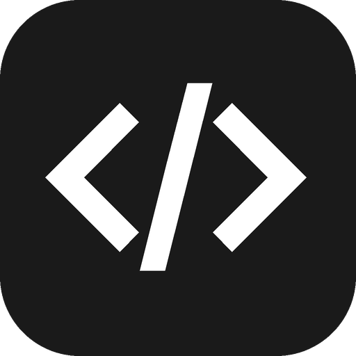

<div align="center">



# Black Box

Claude Code CLI 桌面客户端。

[](LICENSE)
[](https://tauri.app)

**[English](README.md)** | **[中文](README_zh.md)**

</div>

## 简介

Black Box 将 [Claude Code CLI](https://docs.anthropic.com/en/docs/claude-code) 封装为原生桌面应用 — 文件浏览、会话管理、流式对话、结构化权限控制集于一窗。

## 从源码构建

### 前置条件

- Node.js 20+
- pnpm
- Rust（通过 [rustup](https://rustup.rs) 安装）
- 平台 SDK：Xcode CLT (macOS) / Visual Studio Build Tools + C++ (Windows) / WebKit2GTK (Linux)

### 步骤

```bash
pnpm install
pnpm tauri build    # 生产构建 → 安装包在 src-tauri/target/release/bundle/
pnpm tauri dev      # 开发模式，支持热更新
```

## 技术栈

| 层 | 技术 |
|---|------|
| 桌面框架 | Tauri 2 |
| 前端 | React 19 + TypeScript |
| 样式 | Tailwind CSS 4 |
| 状态管理 | Zustand 5 |
| 编辑器 | CodeMirror 6 |
| 构建工具 | Vite 7 |
| 后端 | Rust |

## 许可证

Apache License 2.0 — 见 [LICENSE](LICENSE)。

## 致谢

基于 [TOKENICODE](https://github.com/yiliqi78/TOKENICODE) 开发。
